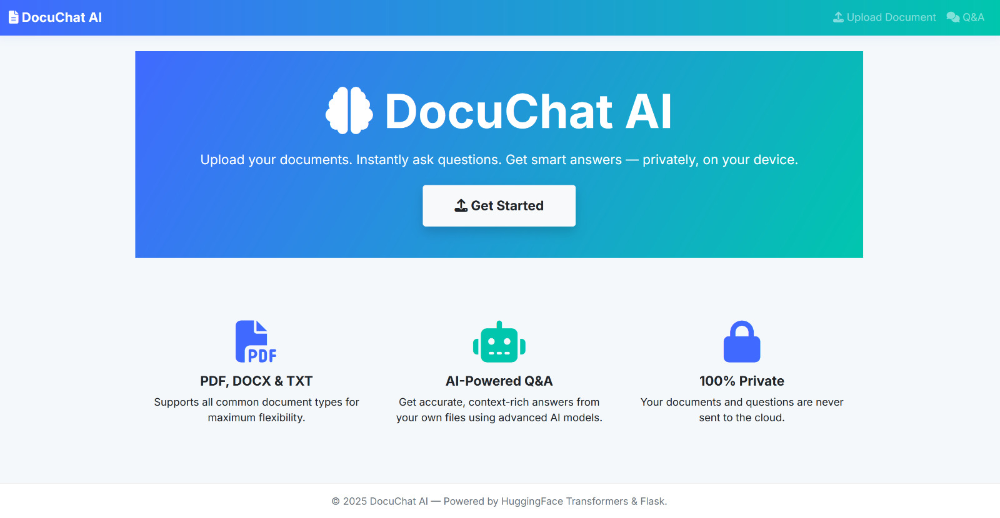
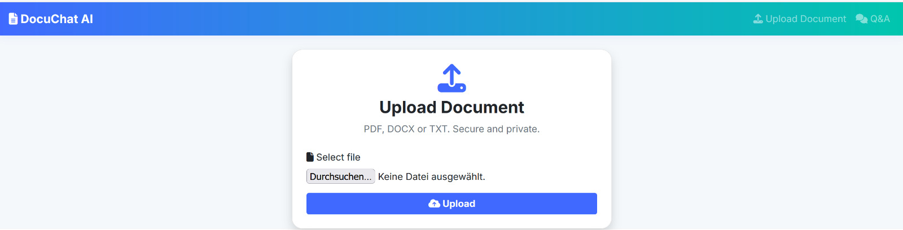
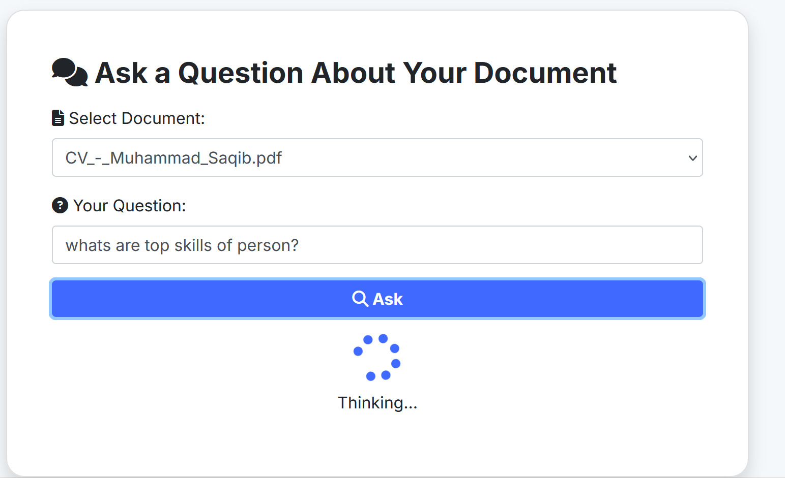
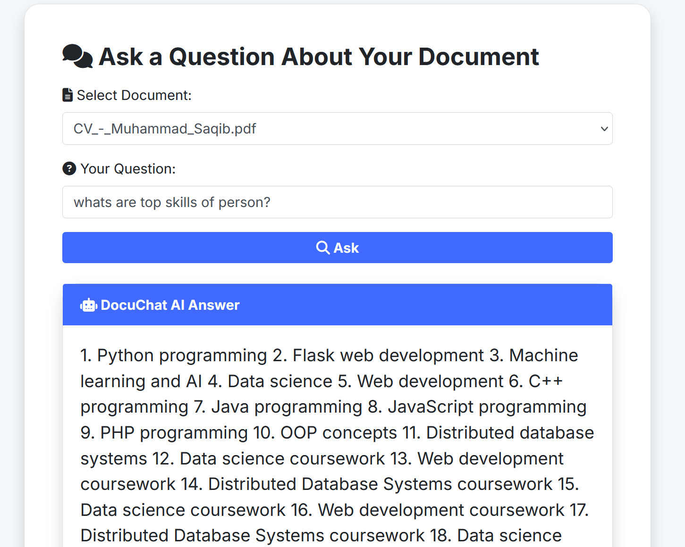

# 🚀 DocuChat AI

*Ask Questions. Get Answers. All from Your Own Documents—Securely and Instantly.*

---


DocuChat AI is a **private, smart, and beautiful document Q&A web app**.  
**Upload any PDF, DOCX, or TXT file. Instantly ask questions and get clear, context-aware answers—powered entirely by local AI.**  
No data leaves your device. Your privacy, your answers.

---

## 🌟 Features

- **🧠 Chat With Your Documents:** Upload resumes, reports, academic papers, notes, or contracts—ask anything and get relevant answers in seconds.
- **🔒 100% Local & Private:** No cloud, no API calls. Everything runs on your machine with HuggingFace Transformers and FAISS.
- **⚡ Ultra-fast, Lightweight Models:** Uses TinyLlama or Phi-2 for instant answers, even on laptops.
- **📄 Semantic Search:** Finds the best context in your document using state-of-the-art embeddings.
- **🎨 Professional UI:** Modern Bootstrap, animated loader, collapsible context, and mobile responsive.
- **🖼️ Stunning Look:** Landing page, upload flow, and Q&A all designed for clarity and trust.

---

## 🖥️ Screenshots

### Homepage  


---

### Upload Page  


---

### Spinner / Loading (while answering)  


---

### AI Q&A Result  


---

## 🛠️ Tech Stack

- **Flask (Python 3.8+)** – backend and routing
- **Bootstrap 4/5 & FontAwesome** – modern responsive UI
- **HuggingFace Transformers** – local LLM (TinyLlama, Phi-2, etc.)
- **SentenceTransformers** – fast local embeddings
- **FAISS** – vector similarity search for semantic retrieval
- **PyPDF2, python-docx** – robust text extraction

---

## 🚀 How It Works

1. **Upload a document** (PDF, DOCX, or TXT)
2. **Text is extracted, chunked, and embedded**
3. **Semantic search** finds the most relevant parts for your question
4. **Local LLM** answers your question using both your context and the original question
5. **Results displayed** instantly, with context you can review and trust

---

## ⚡ Quickstart

Clone and run in under 3 minutes:

```bash
git clone https://github.com/yourusername/docuchat-ai.git
cd docuchat-ai
python -m venv venv
source venv/bin/activate      # On Windows: venv\Scripts\activate
pip install -r requirements.txt
python app.py
